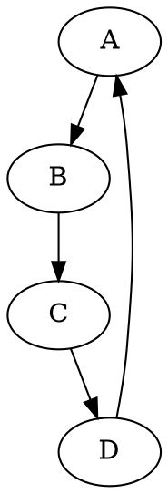
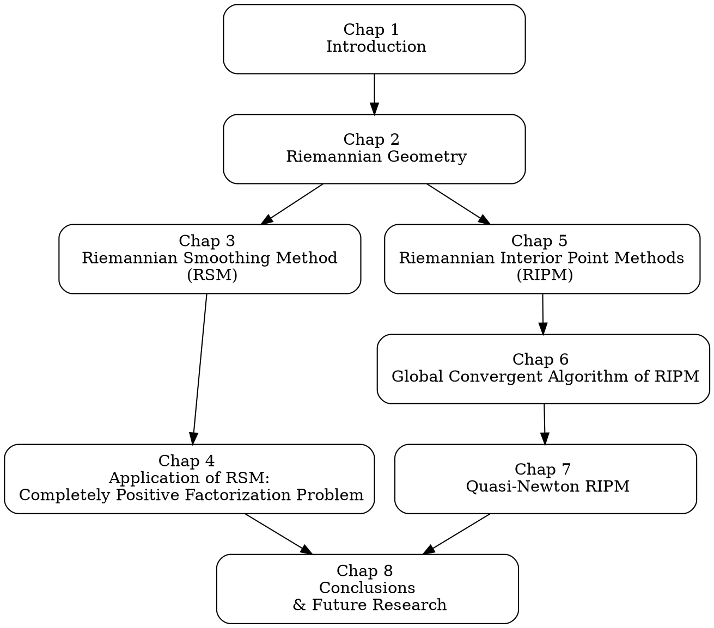

# DOT语言和Graphviz 

DOT（直接有向图文本）是一种图描述语言。[Graphviz](https://graphviz.org/)（Graph Visualization Software）是一个开源的图可视化软件包，其中包括用于渲染从DOT语言描述的图形的工具。这些工具通常用于表示网络结构、有向图、流程图、决策树、组织图等等。

## DOT语言

DOT语言是一种相对简单的文本-based 格式，用于描述图、节点和边。下面是一个简单的DOT语言例子，描述了一个有向图：



在这个例子中，`digraph G` 定义了一个名为 `G` 的新的有向图。图中包含四个节点（`A`, `B`, `C`, `D`）和四条边（`A -> B`, `B -> C`, `C -> D`, `D -> A`）。

## Graphviz

Graphviz 包括一组用于布局和渲染图形的工具。最常用的工具是 `dot`，它可以处理有向图。其他工具如 `neato`, `fdp`, `sfdp`, `twopi` 等也有各自的用途和特点。

常见的用法是将DOT文件作为输入，并生成如PNG、SVG、PDF等格式的图像文件。例如，要从上面的DOT例子生成一个PNG图片，可以在命令行中运行：

```bash
dot -Tpng input.dot -o output.png
```

其中 `input.dot` 是包含上述DOT代码的文件，`output.png` 是生成的图像。

Graphviz 是一个非常强大的工具，支持节点和边的各种属性（如颜色、形状、标签等），还支持子图、簇等高级功能。

# 推荐的 Online Graphviz Editor

1. 使用在线工具可以不用配置各种环境，适合轻量需求。
2. 最好本地手动保存dot代码，在线工具都是小规模开源，没有账号记录。
3. 下面的在线工具都支持输出svg，部分支持输出png；且都不支持输出pdf；但是svg2pdf可以实现矢量转换，如在线工具：[CloudConvert](https://cloudconvert.com/) 免费，Google账号登陆。

| Online Graphviz Editor                                       | 特点                                                         |
| ------------------------------------------------------------ | ------------------------------------------------------------ |
| [Graphviz Visual Editor](http://magjac.com/graphviz-visual-editor/) | 有补帧动画，很丝滑；支持网页本地存贮（更换电脑或浏览器则不可） |
| [Sketchviz](https://sketchviz.com/new)                       | 支持 Sketchy 素描风格; [Graphviz Examples and Tutorial](https://sketchviz.com/graphviz-examples) 做的不错 |
| [Edotor](https://edotor.net/)                                | 很多预加载例子                                               |
| [Graphviz Online](https://dreampuf.github.io/GraphvizOnline/) | 暗色背景的代码编辑器                                         |
| [Viz.js](https://viz-js.com/)                                | 支持更多的输出格式                                           |
| [Cheatsheet](https://www.devtoolsdaily.com/cheatsheets/graphviz/) |                                                              |

以下是一个示例，制作一篇thesis的各章节的z关系图。可以使用上述任何在线工具编译。



最终输出效果如下。

