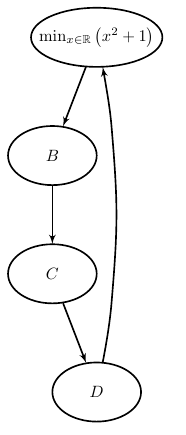

```latex
\documentclass{article}
\usepackage[x11names, svgnames, rgb]{xcolor}
\usepackage[utf8]{inputenc}
\usepackage{tikz}
\usetikzlibrary{snakes,arrows,shapes}
\usepackage{amsmath}


\begin{document}
\pagestyle{empty} % 这一行将页面样式设置为空白页。这意味着在文档中的每一页都不会显示页眉或页脚。
%
%
%

\enlargethispage{100cm} % 这一行将当前页面的高度增加了100厘米。通常，这是为了容纳较大的图形或其他内容。
% Start of code
% \begin{tikzpicture}[anchor=mid,>=latex',line join=bevel,]
\begin{tikzpicture}[>=latex',line join=bevel,]
  \pgfsetlinewidth{1bp}
%%
\pgfsetcolor{black}
  % Edge: A -> B
  \draw [->] (47.464bp,216.05bp) .. controls (44.479bp,208.32bp) and (40.869bp,198.96bp)  .. (33.476bp,179.79bp);
  % Edge: B -> C
  \draw [->] (27.0bp,143.7bp) .. controls (27.0bp,136.41bp) and (27.0bp,127.73bp)  .. (27.0bp,108.1bp);
  % Edge: C -> D
  \draw [->] (33.536bp,72.055bp) .. controls (36.521bp,64.317bp) and (40.131bp,54.957bp)  .. (47.524bp,35.789bp);
  % Edge: D -> A
  \draw [->] (57.654bp,36.092bp) .. controls (59.676bp,46.431bp) and (61.981bp,59.91bp)  .. (63.0bp,72.0bp) .. controls (67.032bp,119.83bp) and (67.032bp,132.17bp)  .. (63.0bp,180.0bp) .. controls (62.323bp,188.03bp) and (61.079bp,196.67bp)  .. (57.654bp,215.91bp);
  % Node: A
\begin{scope}
  \definecolor{strokecol}{rgb}{0.0,0.0,0.0};
  \pgfsetstrokecolor{strokecol}
  \draw (54.0bp,234.0bp) ellipse (40.0bp and 18.0bp);
  \draw (54.0bp,234.0bp) node {$\min _{x \in \mathbb{R}}\left(x^2+1\right)$};
\end{scope}
  % Node: B
\begin{scope}
  \definecolor{strokecol}{rgb}{0.0,0.0,0.0};
  \pgfsetstrokecolor{strokecol}
  \draw (27.0bp,162.0bp) ellipse (27.0bp and 18.0bp);
  \draw (27.0bp,162.0bp) node {$B$};
\end{scope}
  % Node: C
\begin{scope}
  \definecolor{strokecol}{rgb}{0.0,0.0,0.0};
  \pgfsetstrokecolor{strokecol}
  \draw (27.0bp,90.0bp) ellipse (27.0bp and 18.0bp);
  \draw (27.0bp,90.0bp) node {$C$};
\end{scope}
  % Node: D
\begin{scope}
  \definecolor{strokecol}{rgb}{0.0,0.0,0.0};
  \pgfsetstrokecolor{strokecol}
  \draw (54.0bp,18.0bp) ellipse (27.0bp and 18.0bp);
  \draw (54.0bp,18.0bp) node {$D$};
\end{scope}
%
\end{tikzpicture}
% End of code


%
\end{document}
```





## % Edge: A -> B

```latex

% Edge: A -> B
  \draw [->] (47.464bp,216.05bp) .. controls (44.479bp,208.32bp) and (40.869bp,198.96bp)  .. (33.476bp,179.79bp);
```

这行代码绘制了一个从节点A到节点B的有向边，其中包含了Bezier曲线控制点以使边曲线化。让我逐行解释这行代码：

- `% Edge: A -> B`：这是一个注释行，用于描述接下来的代码是绘制从节点A到节点B的有向边。

- `\draw [->]`：这是TikZ中用于绘制路径的命令。`[->]` 部分指定了绘制路径的样式，其中 `->` 表示使用箭头来表示路径的方向。

- `(47.464bp,216.05bp)`：这是绘制路径的起始点的坐标，坐标单位是“bp”（点），这里是点的x坐标是47.464，y坐标是216.05。

- `.. controls (44.479bp,208.32bp) and (40.869bp,198.96bp) .. `：这部分定义了Bezier曲线的控制点。在这里，我们有两对控制点，每对包含一个输入控制点和一个输出控制点。曲线从起始点开始，然后根据这些控制点弯曲。
    - `(44.479bp,208.32bp)` 是第一对控制点，它会影响路径的形状。

    - `(40.869bp,198.96bp)` 是第二对控制点。

- `(33.476bp,179.79bp)` 是路径的终点。

综合起来，这行代码绘制了一个从起始点到终点的有向边，路径会根据控制点的设置而弯曲，箭头表示路径的方向。Bezier曲线控制点用于控制路径的曲率，使得边看起来更加曲线化。这是TikZ中用于绘制复杂路径的一种方法。

## % Node: A

```latex
% Node: A
\begin{scope}
  \definecolor{strokecol}{rgb}{0.0,0.0,0.0};
  \pgfsetstrokecolor{strokecol}
  \draw (54.0bp,234.0bp) ellipse (27.0bp and 18.0bp);
  \draw (54.0bp,234.0bp) node {$\min _{x \in \mathbb{R}}\left(x^2+1\right)$};
\end{scope}
```

这段代码是用于绘制一个节点A，该节点是一个椭圆形，椭圆上还带有标签“A”。以下是代码的逐行解释：

- `% Node: A`：这是一个注释行，用于描述接下来的代码是用于绘制节点A的。

- `\begin{scope}`：这是TikZ中用于创建一个作用域（scope）的命令。作用域可以用于将一组图形元素组织在一起，并在必要时对它们进行统一的变换或样式设置。

- `\definecolor{strokecol}{rgb}{0.0,0.0,0.0};`：这一行定义了名为`strokecol`的颜色，RGB值为红色、绿色和蓝色分量都为0，表示黑色。这是一个用于设置描边颜色的颜色定义。

- `\pgfsetstrokecolor{strokecol}`：这一行将描边颜色设置为之前定义的黑色。这意味着节点A的椭圆将使用黑色线条绘制。

- `\draw (54.0bp,234.0bp) ellipse (27.0bp and 18.0bp);`：这一行绘制了一个椭圆，椭圆的中心坐标是`(54.0bp, 234.0bp)`，椭圆的长轴半径为27.0bp，短轴半径为18.0bp。这是节点A的外观。

- `\draw (54.0bp,234.0bp) node {$A$};`：这一行在椭圆的中心位置添加了文本标签“$A$”，这就是节点A的标签。

- `\end{scope}`：这一行结束了作用域。在作用域内部定义的颜色和绘图属性仅影响该作用域内的图形元素，而不会影响作用域外的其他图形元素。这有助于组织和控制图形的样式和属性。