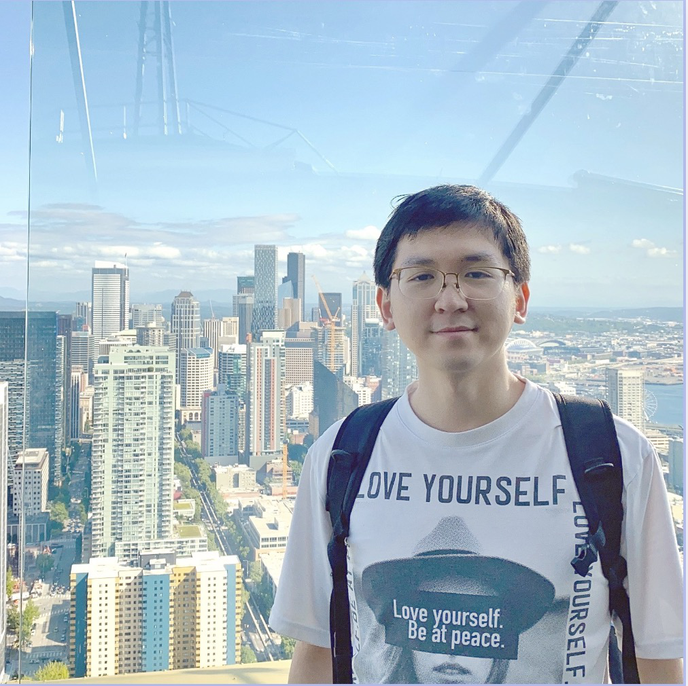

::: {.profile}

<strong>Zhijian</strong> Lai (赖志坚)

{.profile-photo fig-alt="Zhijian Lai"}

Postdoctoral Researcher, Beijing International Center for Mathematical Research

Peking University · Beijing, China

  <a href="mailto:lai_zhijian@pku.edu.cn">Email</a>
  <a href="https://scholar.google.com/citations?user=0OJnW0wAAAAJ&hl=en&oi=sra">Google Scholar</a>
  <a href="https://github.com/GALVINLAI">GitHub</a>
  <a href="http://orcid.org/0009-0001-1548-0794">ORCID</a>

:::

I am a postdoctoral researcher at the [Beijing International Center for Mathematical Research (BICMR)](http://bicmr.pku.edu.cn/), [Peking University](https://english.pku.edu.cn/), advised by [Zaiwen Wen](http://faculty.bicmr.pku.edu.cn/~wenzw/).

Previously, I received my Ph.D. and M.S. in Policy and Planning Sciences from the University of Tsukuba in 2024 and 2021, respectively, under the supervision of [Prof. Akiko Yoshise](https://infoshako.sk.tsukuba.ac.jp/~yoshise/), and my B.Mgmt. in Logistics Management from Dongbei University of Finance and Economics in 2017.

## Research Interests

My research interests lie in the intersection of the following areas:

- **Riemannian optimization**
  - constrained optimization on manifolds
  - nonsmooth and smoothing methods on matrix manifolds

- **Quantum algorithms and quantum optimization**
  - optimization-based quantum search
  - Grover-compatible manifold algorithms
  - quantum circuit design and state preparation

- **Variational quantum algorithms**
  - parameterized quantum circuits
  - parameter-shift rules and derivative estimation
  - coordinate descent methods

## News and Updates

::: {.news-list}
- **2026.06.01 · New preprint.** Hantao Nie, **Zhijian Lai**, Dong An. *Pauli-structured preconditioning for quantum linear system solvers*. [arXiv:2606.01733](https://arxiv.org/abs/2606.01733).

- **2026.03.27 · New preprint.** **Zhijian Lai**, Dong An, Jiang Hu, Zaiwen Wen. *Achieving double-logarithmic precision dependence in optimization-based quantum unstructured search*. [arXiv:2603.26039](https://arxiv.org/abs/2603.26039).

- **2026.02.25 · New preprint.** **Zhijian Lai**, Hantao Nie, Jiayuan Wu, Dong An. *Quantum circuit design from a retraction-based Riemannian optimization framework*. [arXiv:2602.20605](https://arxiv.org/abs/2602.20605).

- **2026 · New publication.** **Zhijian Lai**, Jiang Hu, Dong An, Zaiwen Wen. *Extended parameter-shift rules with minimal derivative variance for parameterized quantum circuits*. [Physical Review Applied 25(1), 014005](https://journals.aps.org/prapplied/abstract/10.1103/f57b-q28w).

- **2026 · New publication.** **Zhijian Lai**, Jiang Hu, Taehee Ko, Jiayuan Wu, Dong An. *Interpolation-based coordinate descent method for parameterized quantum circuits*. [Communications Physics 9, 41](https://www.nature.com/articles/s42005-025-02473-8).

- **2025.12.11 · New preprint.** Chenyi Li, **Zhijian Lai**, Dong An, Jiang Hu, Zaiwen Wen. *Advancing Mathematical Research via Human-AI Interactive Theorem Proving*. [arXiv:2512.09443](https://arxiv.org/abs/2512.09443).

- **2025.12.09 · New preprint.** **Zhijian Lai**, Dong An, Jiang Hu, Zaiwen Wen. *A Grover-compatible manifold optimization algorithm for quantum search*. [arXiv:2512.08432](https://arxiv.org/abs/2512.08432).

- **2025.08.27 · Grant.** Granted the NSFC Young Scientists Fund (Category C), project *Manifold Optimization Theory and Algorithms in Quantum Information Science*.

- **2025.06.13 · Lecture notes.** It has been one year since I started my postdoc at PKU. During this time, I taught *Calculus B* for two semesters and prepared over a thousand pages of lecture notes in Chinese. [AM-B-1 collected notes](https://gitee.com/galvin-lai/Advanced-Mathematics-Class-B-07/raw/master/AM-B-1-PKU-ALL.pdf), [course homepage](https://gitee.com/galvin-lai/Advanced-Mathematics-Class-B-07); [AM-B-2 collected notes](https://gitee.com/galvin-lai/Advanced-Mathematics-Class-B2-07/raw/master/AM-B-2-PKU-ALL.pdf), [course homepage](https://gitee.com/galvin-lai/Advanced-Mathematics-Class-B2-07).

- **2024.10.21 · New publication.** Xin Yang, Heng Chang, **Zhijian Lai**, Jinze Yang, Xingrun Li, Yu Lu, Shuaiqiang Wang, Dawei Yin, Erxue Min. [*Hyperbolic contrastive learning for cross-domain recommendation*](https://dl.acm.org/doi/abs/10.1145/3627673.3679572). CIKM 2024.

- **2024.08.04 · Software.** My PhD work, the Interior Point Newton Method on manifolds, has been implemented in **Manopt.jl**. See the [documentation](https://manoptjl.org/stable/solvers/interior_point_Newton/).

- **2024.05.14 · Milestone.** I started my postdoctoral life at Peking University. [Photo](images/weiming_lake_20240516092531.jpg).

- **2024.03.25 · Graduation.** I obtained my Ph.D. certificate and graduated from the [Graduate School of Systems and Information Engineering](https://www.sie.tsukuba.ac.jp/eng/), [University of Tsukuba](https://www.tsukuba.ac.jp/en/). Many thanks to my supervisor [Prof. Akiko Yoshise](https://infoshako.sk.tsukuba.ac.jp/~yoshise/).

- **2024.03.05--2024.05.13 · Visit.** I was a research visitor at [BICMR](https://bicmr.pku.edu.cn/), Peking University.

- **2024.03.04 · New publication.** **Zhijian Lai**, Akiko Yoshise. [*Riemannian Interior Point Methods for Constrained Optimization on Manifolds*](https://doi.org/10.1007/s10957-024-02403-8). *Journal of Optimization Theory and Applications*, 201(1), 433--469.

- **2024.01.22 · Graduation.** I finished my PhD final defense. [Slides](files/slides/2024_01_22_PhD_FinalDefense.pdf), [photo](images/sato_yoshise_lai_2024-01-22.jpg).

- **2023.08 · Conference.** I gave an oral presentation at [ICIAM 2023](https://iciam2023.org/) at Waseda University, Tokyo, Japan. [Photo](images/ICIAM2023.jpg). Many thanks to [Prof. Hiroyuki Sato](https://sites.google.com/site/hiroyukisatoeng/home) for inviting and organizing the minisymposium.

- **2023.08 · Conference.** I presented a [poster](talks.qmd) at the [Summer School on Continuous Optimization and Related Fields](https://www.ism.ac.jp/~mirai/sscoke/2023/) at the Institute of Statistical Mathematics in Tachikawa, Tokyo. [Photo](images/2023-08-11-sscoke-group-photo-b.jpg).

- **2023.06 · Website.** Opened this website.
:::

::: {.visitor-map}

:::
