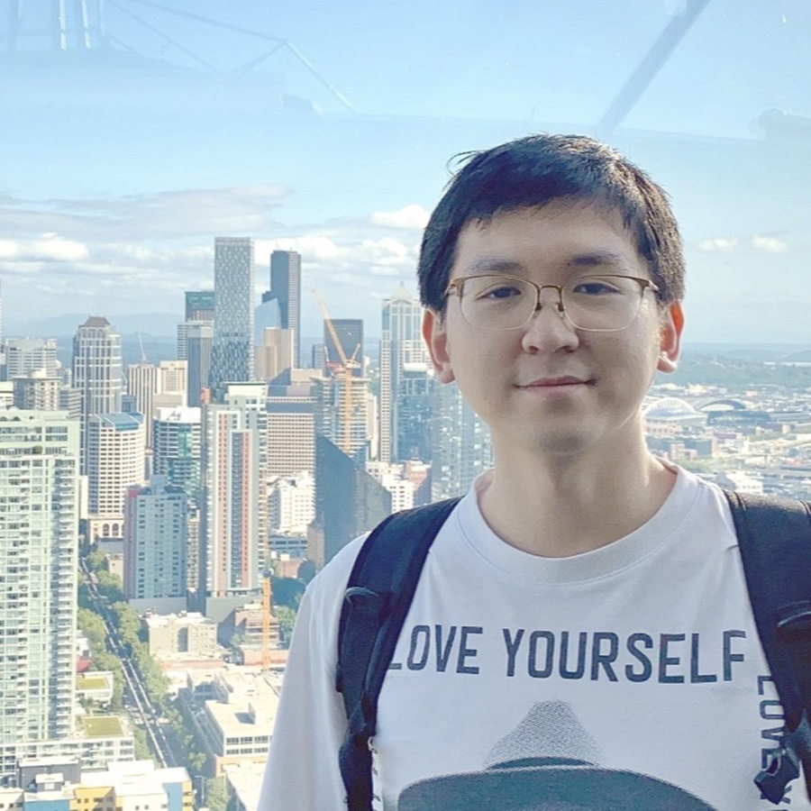
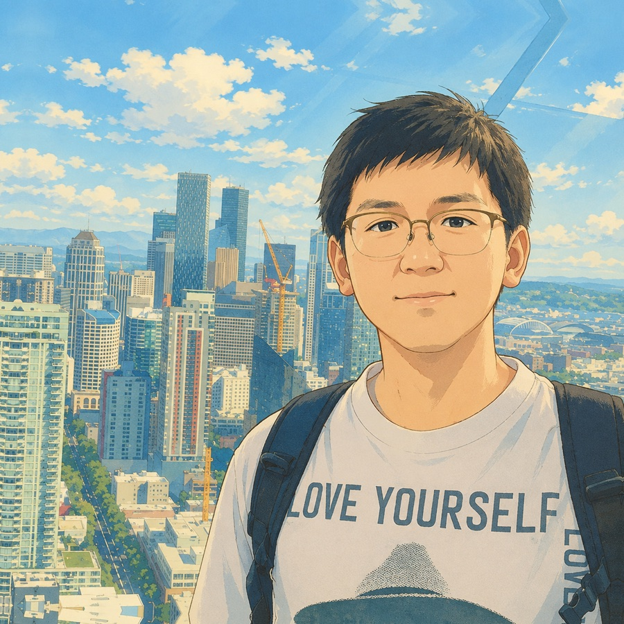

<style>
#title-block-header {
  display: none;
}
</style>

::: {.home-title}
<span class="home-name"><strong>Zhijian</strong> Lai <span class="meta">(赖志坚)</span></span>
:::

:::: {.home-intro .columns}
::: {.column width="35%"}
```{=html}
<!-- Restore this static portrait if you want to remove the comparison slider:

-->
<div class="portrait-compare" style="--split: 50%;">
  
  <div class="portrait-compare-overlay">
    
  </div>
  <div class="portrait-compare-divider" aria-hidden="true"></div>
  <input class="portrait-compare-range" type="range" min="0" max="100" value="50" aria-label="切换两张头像图片">
</div>
<script>
document.addEventListener("DOMContentLoaded", () => {
  document.querySelectorAll(".portrait-compare").forEach((slider) => {
    const range = slider.querySelector(".portrait-compare-range");
    const update = () => slider.style.setProperty("--split", `${range.value}%`);
    range.addEventListener("input", update);
    update();
  });
});
</script>
```

<!--
<div class="profile-subtitle">北京国际数学研究中心博士后研究员</div>
<div class="profile-subtitle">北京大学 · 中国北京</div>
-->

<div class="profile-links">
  <a href="mailto:lai_zhijian@pku.edu.cn">邮箱</a>
  <a href="https://scholar.google.com/citations?user=0OJnW0wAAAAJ&hl=en&oi=sra">Google Scholar</a>
  <a href="https://github.com/GALVINLAI">GitHub</a>
  <a href="http://orcid.org/0009-0001-1548-0794">ORCID</a>
</div>

```{=html}
<div class="profile-email">
  <span class="profile-email-text">lai_zhijian [at] pku [dot] edu</span>
  <button class="email-copy-button" type="button" data-email="lai_zhijian@pku.edu.cn" aria-label="复制邮箱地址">复制</button>
</div>
<script>
document.addEventListener("DOMContentLoaded", () => {
  document.querySelectorAll(".email-copy-button").forEach((button) => {
    button.addEventListener("click", async () => {
      const email = button.dataset.email;
      try {
        if (navigator.clipboard && window.isSecureContext) {
          await navigator.clipboard.writeText(email);
        } else {
          const input = document.createElement("input");
          input.value = email;
          input.setAttribute("readonly", "");
          input.style.position = "fixed";
          input.style.opacity = "0";
          document.body.appendChild(input);
          input.select();
          document.execCommand("copy");
          input.remove();
        }
        button.textContent = "已复制";
        button.classList.add("is-copied");
        window.setTimeout(() => {
          button.textContent = "复制";
          button.classList.remove("is-copied");
        }, 1400);
      } catch {
        button.textContent = "复制失败";
        window.setTimeout(() => {
          button.textContent = "复制";
        }, 1400);
      }
    });
  });
});
</script>
```
:::

::: {.column width="5%"}
:::

::: {.column width="60%"}
我目前是[北京大学](https://english.pku.edu.cn/)[北京国际数学研究中心（BICMR）](http://bicmr.pku.edu.cn/)博士后研究员，合作导师为[文再文](http://faculty.bicmr.pku.edu.cn/~wenzw/)教授。

此前，我分别于 2024 年和 2021 年在日本筑波大学获得政策与规划科学博士和硕士学位，导师为[吉濑章子教授](https://infoshako.sk.tsukuba.ac.jp/~yoshise/)；2017 年在东北财经大学获得物流管理学士学位。

我的研究兴趣主要位于以下方向的交叉处：

- **量子计算与优化**
  - 基于优化的 Grover 量子搜索
  - 与 Grover 算法兼容的流形算法
  - 量子线路设计与量子态制备

- **变分量子算法**
  - 参数化量子线路
  - 参数平移法则与导数估计
  - 坐标下降方法

- **黎曼优化**
  - 流形约束优化
  - 矩阵流形上的非光滑方法
:::
::::

## 近期动态

::: {.news-list}

::: {.timeline-item}
::: {.timeline-date}
2025.08.27.
:::
::: {.timeline-body}
获批国家自然科学基金青年科学基金项目（C 类），项目题目为 *量子信息科学中的流形优化理论与算法*。
:::
:::

::: {.timeline-item}
::: {.timeline-date}
2025.06.13.
:::
::: {.timeline-body}
我在北大开始博士后工作已满一年。在这一年中，我连续两个学期讲授了《高等数学 B》，并整理了超过一千页的中文讲义。[高数 B（一）合订版讲义](https://gitee.com/galvin-lai/Advanced-Mathematics-Class-B-07/raw/master/AM-B-1-PKU-ALL.pdf)，[课程主页](https://gitee.com/galvin-lai/Advanced-Mathematics-Class-B-07)；[高数 B（二）合订版讲义](https://gitee.com/galvin-lai/Advanced-Mathematics-Class-B2-07/raw/master/AM-B-2-PKU-ALL.pdf)，[课程主页](https://gitee.com/galvin-lai/Advanced-Mathematics-Class-B2-07)。
:::
:::

::: {.timeline-item}
::: {.timeline-date}
2024.08.04.
:::
::: {.timeline-body}
我的博士期间工作，流形上的内点牛顿方法，已经在 **Manopt.jl** 中实现。参见[文档](https://manoptjl.org/stable/solvers/interior_point_Newton/)。
:::
:::

::: {.timeline-item}
::: {.timeline-date}
2024.05.14.
:::
::: {.timeline-body}
我开始在北京大学从事博士后研究工作。[照片](../images/weiming_lake_20240516092531.jpg)。
:::
:::

::: {.timeline-item}
::: {.timeline-date}
2024.03.25.
:::
::: {.timeline-body}
我获得博士学位证书，并从[筑波大学系统与信息工程研究科](https://www.sie.tsukuba.ac.jp/eng/)毕业。非常感谢我的导师[吉濑章子教授](https://infoshako.sk.tsukuba.ac.jp/~yoshise/)。
:::
:::

::: {.timeline-item}
::: {.timeline-date}
2024.03.05--05.13.
:::
::: {.timeline-body}
我在北京大学 [BICMR](https://bicmr.pku.edu.cn/) 进行研究访问。
:::
:::

::: {.timeline-item}
::: {.timeline-date}
2024.01.22.
:::
::: {.timeline-body}
我完成了博士最终答辩。[Slides](../files/slides/2024_01_22_PhD_FinalDefense.pdf)，[照片](../images/sato_yoshise_lai_2024-01-22.jpg)。
:::
:::

::: {.timeline-item}
::: {.timeline-date}
2023.08.
:::
::: {.timeline-body}
我在日本东京早稻田大学举行的 [ICIAM 2023](https://iciam2023.org/) 上作口头报告。[照片](../images/ICIAM2023.jpg)。感谢[佐藤宽之教授](https://sites.google.com/site/hiroyukisatoeng/home)邀请并组织专题会。
:::
:::

::: {.timeline-item}
::: {.timeline-date}
2023.08.
:::
::: {.timeline-body}
我在东京立川统计数理研究所举办的 [Summer School on Continuous Optimization and Related Fields](https://www.ism.ac.jp/~mirai/sscoke/2023/) 上展示了[海报](talks.qmd)。[照片](../images/2023-08-11-sscoke-group-photo-b.jpg)。
:::
:::

::: {.timeline-item}
::: {.timeline-date}
2023.06.
:::
::: {.timeline-body}
开通个人主页。
:::
:::
:::
